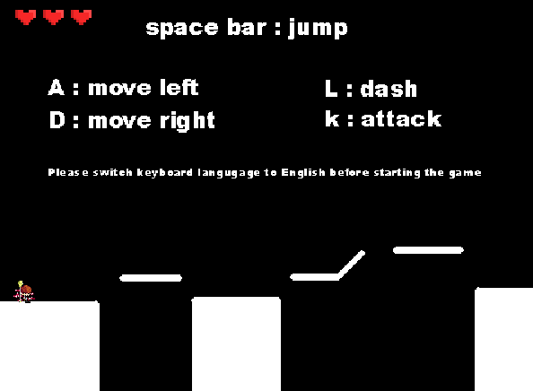
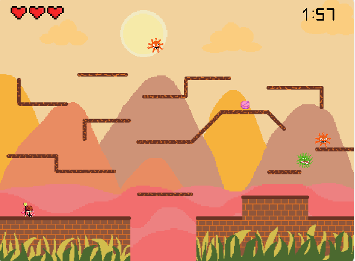
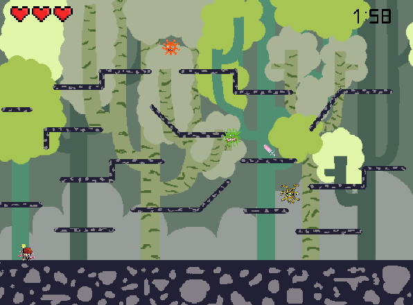

# 🦠 Pandemic

**"Pandemic"** เป็นเกมแนวผจญภัยที่ผู้เล่นจะได้รับบทบาทเป็นหมอผู้กล้าหาญ มีภารกิจสำคัญในการกำจัดไวรัสที่ระบาดในแต่ละด่าน ตัวเกมมีคอนเซปต์ที่สอดคล้องกับชื่อเกมอย่างชัดเจน ซึ่งหมายถึงการแพร่กระจายของโรคร้ายที่ส่งผลกระทบในหลายประเทศและทวีป โดยเนื้อเรื่องจะแบ่งออกเป็นด่านต่างๆ ซึ่งแต่ละด่านเปรียบเสมือนการแพร่ระบาดของไวรัสในภูมิภาคต่างๆ ของโลก 🌍💉

ผู้เล่นจะต้องเผชิญกับความท้าทายที่ซับซ้อนในแต่ละด่าน และต้องใช้ทักษะ ความรู้ และการวางแผนเพื่อเอาชนะไวรัส พร้อมทั้งฝ่าฟันอุปสรรคต่างๆ เพื่อผ่านไปยังด่านสุดท้าย ที่ซึ่งผู้เล่นจะได้เผชิญหน้ากับไวรัสที่ร้ายแรงที่สุด 🧠💪 และทำภารกิจให้สำเร็จในการกำจัดไวรัสจนหมดไปจากโลก

---

## 🕹️ วิธีการเล่นและรายละเอียดต่างๆ

### **วิธีการควบคุมตัวละครในเกม Pandemic**
* กดปุ่ม **A** เพื่อเดินไปทางซ้าย ⬅️
* กดปุ่ม **D** เพื่อเดินไปทางขวา ➡️
* กดปุ่ม **Space bar** เพื่อกระโดด ⬆️
* กดปุ่ม **K** เพื่อโจมตี 🗡️
* กดปุ่ม **L** เพื่อพุ่ง โดยจะมีคูลดาวน์ในการพุ่งอยู่ที่ 3 วินาที ⚡

---

### **รายละเอียดภายในเกม**
* เกมมีทั้งหมด **8 ด่าน** 🏙️
* ตัวละครมีพลังชีวิตเป็น **3 หัวใจ** ❤️❤️❤️
* ในแต่ละด่านมีเวลาจำกัดให้เล่น **2 นาที** ⏳
* จำนวนไวรัสและพลังชีวิตของไวรัสแต่ละตัวจะแตกต่างกันไปในแต่ละด่าน 😷🦠
* บางด่านจะมีไอเท็มช่วยเหลือ ได้แก่:
  1. **เม็ดยา:** เพิ่มพลังชีวิต 1 หัวใจ แต่จะไม่สามารถเพิ่มได้หากพลังชีวิตเต็มแล้ว 💊
  2. **วัคซีน:** ป้องกันการโจมตีของไวรัสเป็นเวลา 5 วินาที 💉🛡️

* หลังจากผ่านด่านที่ 3, 5, และ 7 จะมีการ์ดให้สุ่มเลือก 2 ใบ 🎴 โดยการ์ดแต่ละใบจะสุ่มเอฟเฟกต์ 2 ใน 3 อย่างมาให้เลือก ได้แก่:
  1. ลดคูลดาวน์การพุ่งลง 0.5 วินาที ⏩
  2. เพิ่มพลังชีวิต 1 หัวใจ ❤️
  3. เพิ่มดาเมจการโจมตี 💥

---

### **ภาพตัวอย่างของเกม**

---

## 🎮 **วิธีการเล่น**
ผู้เล่นจะต้องกำจัดไวรัสในแต่ละด่านให้หมดก่อนจึงจะสามารถผ่านไปยังด่านถัดไปได้ หากตัวละครตกจากที่สูงจนพลังชีวิตหมด ถูกไวรัสโจมตีจนหัวใจหมด หรือหมดเวลาที่กำหนดในด่าน (2 นาที) เกมจะจบลงทันที และผู้เล่นจะต้องเริ่มเกมใหม่ตั้งแต่ต้น.

---

## 🌐 **เข้าไปเล่นเกม**
[คลิกที่นี่เพื่อเล่นเกม](https://scratch.mit.edu/projects/728758266)

---

## 👨‍💻 **จัดทำโดย**
* ปุญญ์ บุญชูวิทย์ - **Designer** 🎨  
* รัชพล แปรงทอง - **Manager and Tester** 🧪  
* อัฎษฎา วิริยา - **Programmer** 👨‍💻