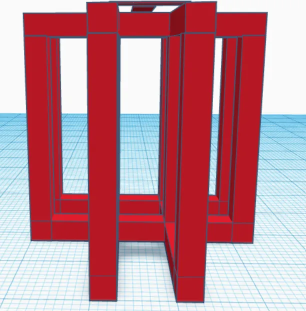
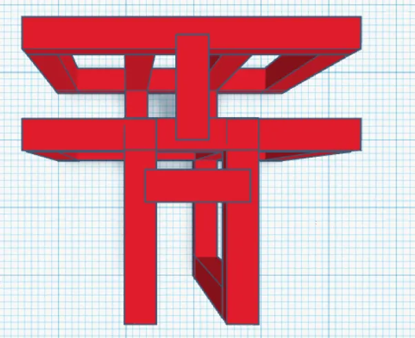
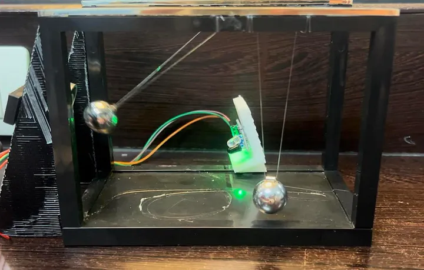
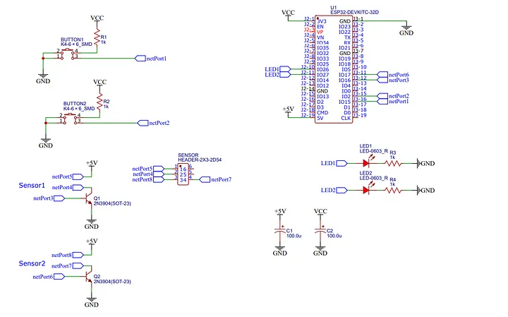
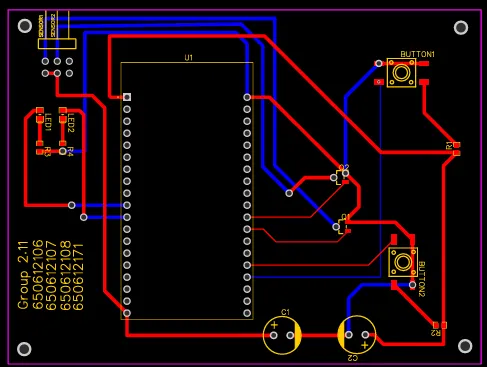

## 🧑🏼‍🔧 Project นี้ อยู่ในรายวิชา **Embedded Lab** ⚡

🎯 **Purpose**  
โครงการนี้มีจุดประสงค์เพื่ออธิบายและแสดงที่มาของสูตรในการหาคาบการแกว่งของลูกตุ้ม (Pendulum) โดยสามารถใช้เป็นสื่อการเรียนการสอนในหัวข้อการเคลื่อนที่แบบการแกว่งของลูกตุ้มได้ อีกทั้งยังพิสูจน์ความถูกต้องของการทดลองโดยใช้ค่าความเร่งเนื่องจากแรงโน้มถ่วง (g) เพื่อยืนยันผลลัพธ์ที่ได้ว่ามีความแม่นยำ 🌍.

---

## 🛠 **System Overview**  
1️⃣ ระบบนี้เริ่มต้นด้วยการยึดลูกตุ้มด้วย **แม่เหล็กไฟฟ้า**  
2️⃣ เมื่อผู้ใช้กดปุ่ม **เริ่มต้น**, ระบบจะปิดการทำงานของแม่เหล็กไฟฟ้า ลูกตุ้มจะเริ่มการแกว่ง  
3️⃣ **เซ็นเซอร์อินฟราเรด (IR)** จะตรวจจับการแกว่งของลูกตุ้มเมื่อผ่านจุดตรวจจับ  
4️⃣ ข้อมูลที่ได้จะถูกนำไปคำนวณคาบการแกว่งของลูกตุ้มและอัตราเร็วเชิงมุม  
5️⃣ ระบบจะควบคุมการเปิด-ปิดแม่เหล็กไฟฟ้าเพื่อช่วยให้ลูกตุ้มแกว่งได้ต่อเนื่อง 🧲.

---

## 🧰 **Materials & Components**
| วัสดุ/อุปกรณ์                                        | จำนวน |
|------------------------------------------------------|-------|
| เซ็นเซอร์อินฟราเรด (IR sensor)                      | 1 ตัว |
| บอร์ดไมโครคอนโทรลเลอร์ ESP32                      | 2 ตัว |
| ตัวรับสัญญาณ Wi-Fi                                  | 1 ตัว |
| ลูกตุ้ม                                              | 2 ลูก |
| เส้นเอ็นสำหรับยึดลูกตุ้ม                              | -     |
| กาว                                                  | -     |
| เครื่องพิมพ์ 3 มิติ (3D printer)                     | -     |
| ปุ่มกด (Push Button)                                 | 1 ชิ้น|
| สายไฟ                                               | -     |
| ตัวต้านทาน (Resistor) และตัวเก็บประจุ (Capacitor)    | -     |
| หลอด LED                                            | 1 หลอด|
| คอมพิวเตอร์สำหรับควบคุมและแสดงผล                    | -     |
| แม่เหล็ก                                            | 1 ตัว |

---

## 📐 **Design Process**  

📌 **Initial Design**  
ในขั้นต้นได้ออกแบบโครงสร้างเป็นรูปตัว T โดยวางแผนให้ปล่อยลูกตุ้มตัวแรกก่อน แล้วทำการวัดคาบการแกว่งเพื่อใช้ในการคำนวณและปล่อยลูกตุ้มตัวที่สองในเวลาที่เหมาะสม เพื่อหลีกเลี่ยงการชนกัน 🕒.

---

### **Design แบบแรก**  
  
<center>Front View</center>

  
<center>Top View</center>

---

### **Design แบบที่ทำเสร็จแล้ว**  
  
<center>Current Design</center>

  
<center>Schematic Diagram</center>

  
<center>PCB</center>

### **Code ที่ใช้**
ESP32 ตัวที่ 1
```bash
#define BUTTON 34
#define SENSOR 23
#define MAGNETIC 27

float previousTimer = 0.000f;
float timer[2] = {0.000f};
int count = 0;
bool statusSensor = false;
bool firstTime = true;
bool buttonPressed = false;
char messageT[75];
bool check = false;

const char ssid[] = "ssid";
const char pass[] = "pass";

const char mqtt_broker[]="test.mosquitto.org";
const char mqtt_topic[]="####";
const char mqtt_client_id[]="####";
int MQTT_PORT=1883;

WiFiClient net;
MQTTClient client;

void connect() {
  Serial.print("checking wifi...");
  while (WiFi.status() != WL_CONNECTED) {
    Serial.print(".");
    delay(1000);
  }

  Serial.print("\nconnecting...");
  while (!client.connect(mqtt_client_id)) {  
    Serial.print(".");
    delay(1000);
  }

  Serial.println("\nconnected!");

  client.subscribe(mqtt_topic);
  // client.unsubscribe("/hello");
}

void messageReceived(String &topic, String &payload) {
  Serial.println("incoming: " + topic + " - " + payload);
  if(payload == "pushButton"){
    digitalWrite(MAGNETIC, HIGH);
    delay(100);
    digitalWrite(MAGNETIC, LOW);
  }
}

void setup() {
  // ปุ่มปล่อยแม่เหล็ก
  pinMode(BUTTON, INPUT);
  // sensor ตรวจจับ
  pinMode(SENSOR, INPUT);
  // แม่เหล็ก
  pinMode(MAGNETIC, OUTPUT);
  digitalWrite(MAGNETIC, LOW);
  WiFi.begin(ssid, pass);
  Serial.begin(9600);
  client.begin(mqtt_broker, MQTT_PORT, net);
  client.onMessage(messageReceived);

  connect();
  lcd.begin();
  lcd.backlight();

  lcd.print("Group2.11");
}

void loop() {
  client.loop();
  if (!client.connected()) {
    connect();
  }

  // จับเวลาและหยุดจับเวลา
  if(digitalRead(SENSOR) == 0 && !statusSensor){
    if (firstTime) {
      firstTime = false;
    } else {
      timer[count] = millis() - timer[count]; // หยุดจับเวลา
      count++;
      if (count == 2) {
        count = 0;
        // ตรวจสอบค่า timer
        bool validData = true;
        for (int i = 0; i < 2; i++) {
          if (timer[i] < 200.000f) {
            validData = false;
            break;
          }
        }
        if (validData) {
          // คำนวณค่า timer เฉลี่ย
          float averageTimer = 0.000f;
          for (int i = 0; i < 2; i++) {
            averageTimer += timer[i];
          }
          averageTimer /= 2.000f;
          // คำนวณค่า g เฉลี่ย
          double g = 0.0;
          double T = 0.0;
          double W = 0.0;
          for (int i = 0; i < 2; i++) {
            g += 4 * PI * PI * (0.09 / ((timer[i] / 500.0) * (timer[i] / 500.0)));
          }
          g /= 2.0;
          W = sqrt(g/0.09);
          lcd.setCursor(0, 1);
          // แสดงผลลัพธ์
          if( g > 8.5){
            lcd.clear();
            lcd.print("T: ");
            lcd.print(averageTimer/500.000);
            lcd.print(" s");
            lcd.setCursor(0, 2);
            lcd.print("g: ");
            lcd.print(g);
            lcd.print(" m/s^2");

            Serial.println();
            Serial.print("T: ");
            Serial.print(averageTimer/500.000);
            Serial.println(" s");
            Serial.print("g: ");
            Serial.print(g);
            Serial.println(" m/s^2");
            Serial.print("w: ");
            Serial.print(W);
            Serial.println(" rad/s");
            sprintf(messageT, "T: %.3f s __ g: %.2f m/s^2 __ w: %.2f rad/s", averageTimer/500.0 , g, W);
            client.publish(mqtt_topic, messageT);
          }
        }
      }
    }
    timer[count] = millis(); // เริ่มจับเวลา
    statusSensor = true;
  }
  if(digitalRead(SENSOR) == 1 && statusSensor){
    statusSensor = false;
  }
}
```
ESP32 ตัวที่ 2
```bash
#define MAGNETIC 27
#define BUTTON 34
#define LED 21

float previousTimer = 0.000f;
float timer[2] = {0.000f};
int count = 0;
bool statusSensor = false;
bool firstTime = true;
bool buttonPressed = false;
char messageT[50];
bool check = false;

void setup() {
  pinMode(BUTTON, INPUT);
  pinMode(MAGNETIC, OUTPUT);
  digitalWrite(MAGNETIC, HIGH);
  pinMode(LED, OUTPUT);
  digitalWrite(LED,HIGH);
}

void loop() {
  if (digitalRead(BUTTON) == HIGH && !buttonPressed) {
    buttonPressed = true;
    digitalWrite(MAGNETIC, LOW);
    digitalWrite(LED,LOW);
    while(buttonPressed){
      
      delay(310);
      digitalWrite(MAGNETIC, HIGH);
      digitalWrite(LED,HIGH);
      delay(300);
      digitalWrite(MAGNETIC, LOW);
      digitalWrite(LED, LOW);
      
    }
  }
  if (digitalRead(BUTTON) == LOW && buttonPressed) {
    buttonPressed = false;
    digitalWrite(MAGNETIC, HIGH);
    digitalWrite(LED,LOW);
  }
}
```

---

## 🎥 **Demonstration Video**  
<iframe width="560" height="315" src="https://www.youtube.com/embed/qnWkYZnzDow?si=WXlDx1Wvk1H5ZI_X" title="YouTube video player" frameborder="0" allow="accelerometer; autoplay; clipboard-write; encrypted-media; gyroscope; picture-in-picture; web-share" referrerpolicy="strict-origin-when-cross-origin" allowfullscreen></iframe>

---

## 🛠️ **Challenges Faced**  
- **Challenge 1:** การวางแผนในการใช้ลูกตุ้ม 2 ตัว แต่เนื่องจากข้อจำกัดด้านเวลา จึงได้ปรับเปลี่ยนเป็นการใช้เพียงแกนเดียวแทน 🎯.  
- **Challenge 2:** แม่เหล็กที่ต้องการไฟขนาด 12V แต่บอร์ด ESP32 ให้ได้เพียง 5V ทำให้ต้องหาทางแก้ปัญหาโดยใช้แหล่งจ่ายไฟเพิ่มเติม 🔌.  
- **Challenge 3:** การทำให้ลูกตุ้มแกว่งอย่างต่อเนื่องเกิดปัญหาจากแรงแม่เหล็กไม่เพียงพอ และแรงต้านอากาศไม่เอื้ออำนวย 🌀.

---

## 📘 **Lessons Learned & Recommendations**  
การออกแบบ PCB ที่ไม่เหมาะสมส่งผลให้การใช้งานไม่เต็มประสิทธิภาพ และการจัดการเวลาไม่ดีทำให้ไม่สามารถแก้ปัญหาทันเวลาได้ ดังนั้นควรมีการวางแผนและวิจัยมากขึ้นในอนาคตเพื่อให้การทดลองราบรื่นขึ้น 📅.

---

## 🙌 **Project Contributors**  
- อภิวิชญ์ บุญฤทธิ์  
- อัฎ​ษฎา วิริยา  
- อาทิตยา เที่ยงอารมย์  
- เอื้ออาทร เอื้อวงศ์ตระกูล