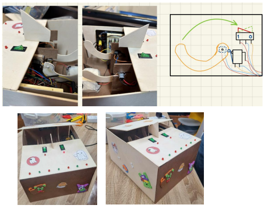
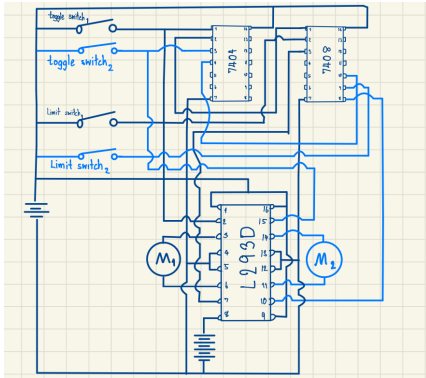
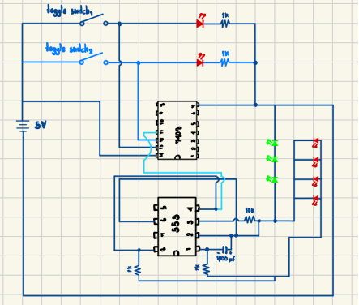
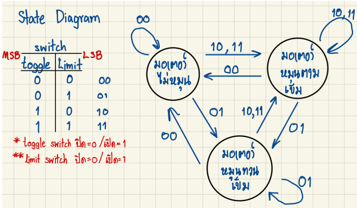
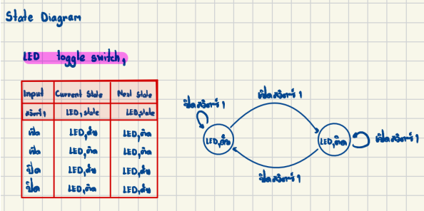
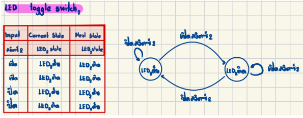
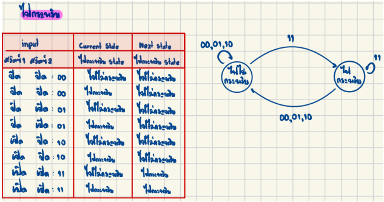

---
title: The (Un)useless box
published: 2023-10-13
tags: ["Project"]
category: Project
image: ./img0.jpg
draft: false
---

# The (Un)useless Box  
_โครงงานนี้เป็นส่วนหนึ่งของรายวิชา 261212 Logic & Digital Circuits Lab ภาคการศึกษาที่ 1 ปีการศึกษา 2566_  
_สาขาวิศวกรรมคอมพิวเตอร์ คณะวิศวกรรมศาสตร์ มหาวิทยาลัยเชียงใหม่_

---

## 🎯 Theory of Change

- **กลุ่มเป้าหมาย (Target Audience):**  
  นักศึกษาคณะวิศวกรรมศาสตร์ สาขาคอมพิวเตอร์  
- **ข้อมูลเชิงลึก (Insight):**  
  นักศึกษามักมองหากิจกรรมที่ช่วยผ่อนคลายความเบื่อหน่ายในเวลาว่าง  
- **พื้นที่การทำงาน (Area):**  
  บนโต๊ะทำงานหรือพื้นที่สำหรับการอ่านหนังสือ  
- **สถานการณ์ปัญหา (Problem Situation):**  
  นักศึกษาจำเป็นต้องมีของเล่นที่ช่วยบรรเทาความเครียดในระหว่างการทำงานหรืออ่านหนังสือเป็นเวลานาน 🧘‍♂️🎮  
  * 🛠 กิจกรรมที่ต้องทำ (Activities)
    - ออกแบบรูปลักษณ์และวิธีการทำงานของวงจร  
    - ศึกษาและเตรียมอุปกรณ์ที่จำเป็น  
    - ประกอบและทดสอบวงจรให้เป็นไปตามแผน  
    - ตกแต่งชิ้นงานให้มีรูปลักษณ์ที่สวยงาม  
  * 🏆 เป้าหมายที่ต้องการบรรลุ (Goals)
    - ช่วยนักศึกษาลดการใช้เวลาบนมือถือ 📵  
    - ช่วยฆ่าเวลายามเบื่อ 😴  
    - เป็นตัวช่วยผ่อนคลายความเครียดจากการทำงาน 🧘‍♀️  
- **❓ What / Why**
การสร้างของเล่นประเภท **“Useless Box”** เป็นตัวอย่างของเล่นเพื่อการคลายเครียดประเภท Fidget Toy ที่ช่วยลดความเครียด โดยการทำซ้ำๆ ซึ่งเป็นการเบี่ยงเบนความสนใจจากสิ่งที่ไม่ชอบไปสู่การกระทำบางอย่างที่ซ้ำๆ อย่างเช่น การเปิด-ปิดกล่องนี้ 🎁🔄  
- **👤 Who**
บุคคลที่ต้องทำงานภายใต้ความเครียดเป็นเวลานานและต้องการสิ่งที่สามารถเบี่ยงเบนความสนใจจากการใช้โทรศัพท์มือถือ 📱➡️🎮  

---

## 🎯 ที่มาและความสำคัญ

จากการวิจัยพบว่าพฤติกรรมกระสับกระส่าย เช่น การขยับตัวหรือทำสิ่งเล็กๆ น้อยๆ ซ้ำๆ สามารถลดความเครียดได้ เนื่องจากเป็นการเบี่ยงเบนความสนใจจากสิ่งที่เราไม่ชอบไปสู่การทำกิจกรรมซ้ำๆ ดังนั้นจึงเป็นที่มาของโปรเจค **The (Un)useless Box** 🧩🔄  

---

## 🎯 วัตถุประสงค์

- ช่วยลดความเครียดและลดเวลาการใช้สายตาไปกับการจดจ่ออยู่กับโทรศัพท์ 📱  
- สร้างเครื่องมือที่สามารถบรรเทาความเครียดจากการทำงานหรือกิจกรรมประจำวัน 🎮  

---

## 🎯 สิ่งที่จะได้รับจากการทำงานครั้งนี้

- มีความเข้าใจเกี่ยวกับ Logic Gate มากขึ้น 🧠  
- นำความรู้ที่ได้มาใช้สร้างชิ้นงานที่สามารถลดความเครียดให้กับผู้อื่น 🛠  
- เรียนรู้การทำงานเป็นทีม 🤝  

---

## 📋 ขั้นตอนการทำงาน

- **Product Concept:**  
  จากพฤติกรรมของผู้ใช้ที่ทำกิจกรรมซ้ำๆ เพื่อบรรเทาความเครียด จึงเกิดไอเดียในการสร้างชิ้นงานนี้ขึ้นมา  
- **Product Design & Material:**
  1. **Product Design & Color & Material:**
  
  2. **Circuit design**
  
  
Motor Schematic

  
  
LED Schematic

  
  
Motor State Diagram

  
  
LED toggle switch 1 State Diagram

  
  
LED toggle switch 2 State Diagram

  
  
LED State Diagram

---

## 🧾 วัสดุอุปกรณ์ที่ใช้พร้อมราคา

| ลำดับ | รายการอุปกรณ์            | จำนวน  | ราคา (บาท) |
|-------|----------------------------|--------|------------|
| 1     | ไม้ 2 แผ่น                 | 2 แผ่น  | 167        |
| 2     | DC Motor Mini Gear 6V       | 2 ตัว   | 40         |
| 3     | IC Motor                    | 1 ตัว   | 80         |
| 4     | บานพับ + กาวร้อน + ปืนกาว | 1 ชุด   | 95         |
| 5     | เลื่อยไม้                   | 1 อัน   | 25         |
| 6     | Breadboard                  | 2 ชิ้น  | ยืมจากห้องแล็บ |
| 7     | สายไฟ                      | 30 เส้น | ยืมจากห้องแล็บ |
| 8     | IC 7404                     | 1 ชิ้น  | ยืมจากห้องแล็บ |
| 9     | IC 7408                     | 1 ชิ้น  | ยืมจากห้องแล็บ |
| 10    | Resistor                    | 6 ชิ้น  | ยืมจากห้องแล็บ |
| 11    | IC 555                      | 1 ชิ้น  | 15         |
| 12    | ตัวเก็บประจุ                | 1 ชิ้น  | 10         |
| 13    | LED                         | 9 ตัว   | ยืมจากห้องแล็บ |
| 14    | Limit Switch                | 2 ชิ้น  | 116        |
| 15    | ถ่านเขียว AA               | 3 ก้อน  | 24         |
| 16    | รางถ่าน                     | 1 อัน   | 12         |
| 17    | ถ่าน Panasonic              | 3 ก้อน  | 123        |

**รวมทั้งหมด:** 692 บาท  

---

## 🕹️ กฎกติกาและวิธีการเล่น

1. เสียบปลั๊กเพื่อให้วงจรทำงาน 🔌  
2. กดสวิตช์ที่กล่องเพื่อเริ่มทำงาน 🔘  
3. เมื่อสวิตช์ถูกกด วงจรจะทำงาน โดยมีแท่งไม้โผล่ออกมาปิดสวิตช์ 🔄  
4. สวิตช์สามารถกดได้ 3 รูปแบบ:  
   - เปิดสวิตช์ด้านซ้ายเพียงอย่างเดียว  
   - เปิดสวิตช์ด้านขวาเพียงอย่างเดียว  
   - เปิดทั้งสองสวิตช์พร้อมกัน ซึ่งจะทำให้ไฟ LED กระพริบจนกว่าไฟดวงใดดวงหนึ่งจะถูกปิด 💡✨  

---

## ⚠️ ข้อควรระวังในการใช้งาน

- ควรรอให้ Action ของกล่องทำงานเสร็จเรียบร้อยก่อน แล้วจึงค่อยกดสวิตช์ใหม่อีกครั้ง 🛑  

---

## จัดทำโดย

- ภาณุเดช เสือเผือก  
- ภูเบศร์ เรืองคุ้ม  
- อภิวิชญ์ บุญฤทธิ์  
- อัฎษฎา วิริยา